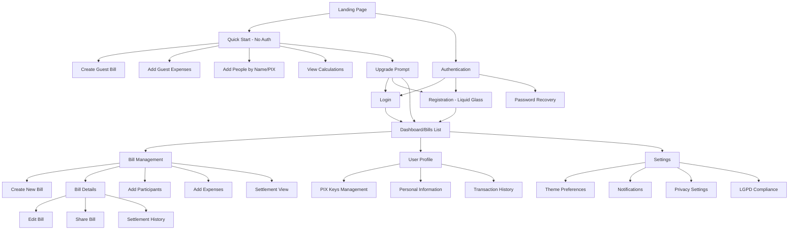
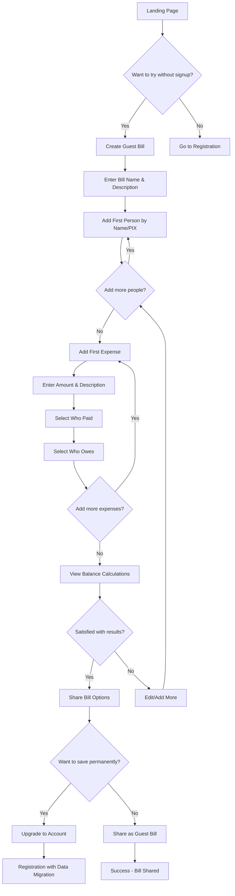
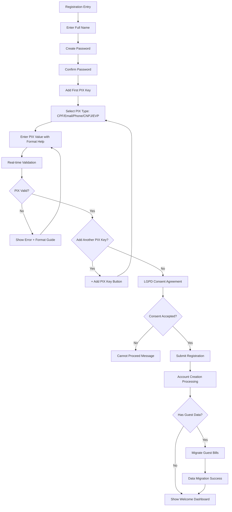
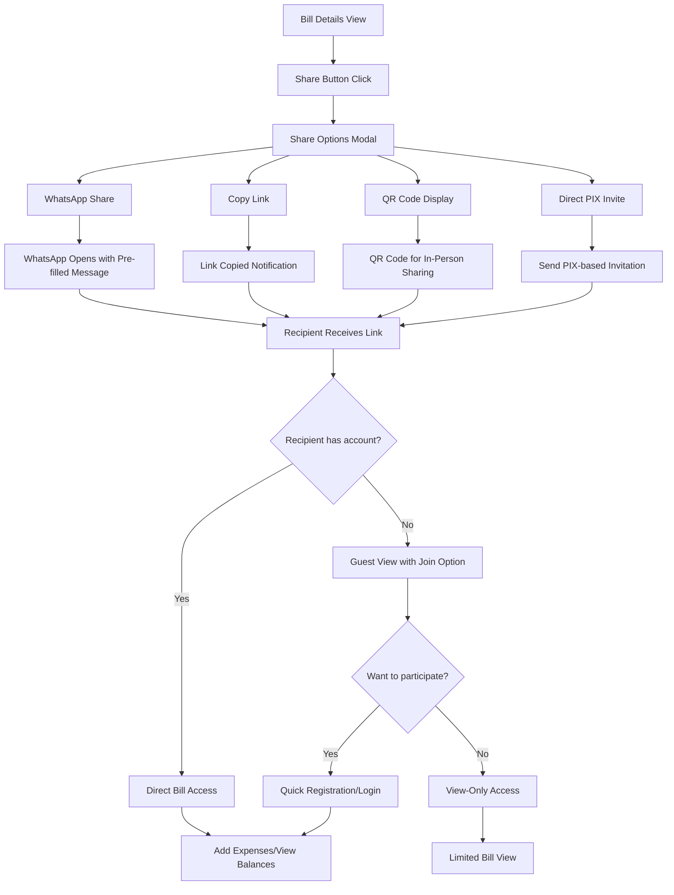

# Faz-o-Pix UI/UX Specification

This document defines the user experience goals, information architecture, user flows, and visual design specifications for Faz-o-Pix's user interface. It serves as the foundation for visual design and frontend development, ensuring a cohesive and user-centered experience.

Faz-o-Pix is a Brazilian bill-splitting application that enables users to easily divide expenses among friends and family using PIX payment integration. The interface must be intuitive, beautiful, and accessible to Brazilian users across all devices.

## Overall UX Goals & Principles

### Target User Personas

- **Social Organizer:** Friends/family members who frequently organize group activities and need to split costs efficiently
- **Occasional User:** People who occasionally join group expenses and need simple, clear guidance
- **PIX-Savvy User:** Brazilian users familiar with PIX payments who expect seamless financial transactions

### Usability Goals

- **Immediate Comprehension:** New users understand the app's purpose within 30 seconds
- **Effortless Expense Creation:** Users can create and share a bill in under 2 minutes
- **PIX Integration Excellence:** Seamless PIX key management and payment processing
- **Mobile-First Experience:** Optimized for Brazilian smartphone usage patterns

### Design Principles

1. **Brazilian-First Design** - Built specifically for Brazilian users, PIX payments, and local cultural patterns
2. **Liquid Glass Aesthetic** - Modern glassmorphism with smooth gradients and premium feel
3. **Dark/Light Harmony** - Seamless theme switching with persistent user preferences
4. **Instant Feedback** - Every interaction provides immediate, clear visual response
5. **Accessible by Design** - WCAG compliance ensuring usability for all Brazilians

### Change Log

| Date | Version | Description | Author |
|------|---------|-------------|--------|
| 2025-01-09 | 1.0 | Initial UI/UX specification creation | Sally (UX Expert) |

## Information Architecture (IA)

### Site Map / Screen Inventory

### Navigation Structure

**Guest Mode Navigation:**
- **Simplified Top Bar**: "Faz-o-Pix" logo, theme toggle, "Save & Sign Up" CTA
- **Progressive Actions**: Linear flow from bill creation → add people → add expenses → view results
- **Floating Upgrade Button**: Persistent liquid glass button encouraging registration
- **Quick Actions**: Add person, add expense, calculate balances

**Primary Navigation (Authenticated):** 
- **Bottom Tab Bar** (Mobile): Bills, Create, Profile, Settings
- **Sidebar** (Desktop): Collapsible with the same primary sections
- **Floating Action Button**: Quick bill creation with liquid glass styling

**Guest-to-Auth Transition:**
- **Smart Upgrade Prompts**: Context-aware suggestions to register (after 3+ expenses, when sharing)
- **Data Preservation**: Clear messaging that guest data will be saved upon registration
- **Social Sharing Integration**: Easy sharing of guest bills via WhatsApp/link before registration

**Breadcrumb Strategy:** 
- **Guest Mode**: Simple "Back" navigation with progress indicators
- **Authenticated Mode**: Full breadcrumb navigation as previously defined
- **Transition Continuity**: Seamless breadcrumb evolution from guest to authenticated

## User Flows

### Flow 1: Guest Bill Creation (Primary Onboarding Flow)

**User Goal:** Create and manage a bill split without registration to test the app's value

**Entry Points:** 
- Landing page "Try Now" button
- Direct link from friend's shared bill
- Search result or social media link

**Success Criteria:** 
- User creates bill with 2+ people and 1+ expense
- Calculations are viewed and understood
- User either upgrades to save or successfully shares bill

#### Flow Diagram

#### Edge Cases & Error Handling:
- **No internet connection:** Local storage with sync notification
- **Invalid PIX key format:** Real-time validation with format suggestions
- **Empty expense amounts:** Prevention with clear error messaging
- **Browser refresh:** Auto-save with recovery prompt
- **Calculation errors:** Visual verification with breakdown display

**Notes:** This flow prioritizes immediate value delivery. The liquid glass UI creates premium feel that builds trust for eventual registration. Progressive disclosure prevents overwhelming new users while demonstrating full capabilities.

### Flow 2: User Registration with Multiple PIX Keys

**User Goal:** Create account with multiple PIX keys for comprehensive payment options

**Entry Points:**
- Guest bill upgrade prompt
- Direct registration from landing page
- Invitation from shared bill

**Success Criteria:**
- Account created with validated PIX keys
- User reaches bills dashboard
- Guest data (if any) successfully migrated

#### Flow Diagram

#### Edge Cases & Error Handling:
- **Duplicate PIX key:** Clear error with suggestion to login instead
- **Network timeout:** Retry mechanism with progress preservation
- **Invalid format entry:** Format-as-you-type with visual feedback
- **LGPD consent withdrawal:** Clear data handling explanation
- **Migration conflicts:** User choice on data preservation

**Notes:** The liquid glass form with smooth animations creates a premium registration experience. Multiple PIX key support addresses Brazilian payment preferences while real-time validation prevents user frustration.

### Flow 3: Bill Sharing & Collaboration

**User Goal:** Share bill with participants and enable collaborative expense tracking

**Entry Points:**
- From bill details "Share" button
- From dashboard "Invite" action
- From settlement view

**Success Criteria:**
- Bill link generated and shared via preferred method
- Recipients can view/participate regardless of account status
- Real-time updates visible to all participants

#### Flow Diagram

#### Edge Cases & Error Handling:
- **Expired share links:** Regeneration option with notification
- **Permission changes:** Clear access level communication
- **Offline sharing:** QR code and cached data strategies
- **Cross-platform compatibility:** Fallback sharing methods
- **Privacy concerns:** Granular sharing permission controls

**Notes:** Brazilian users heavily favor WhatsApp sharing, so this gets priority treatment. The liquid glass share modal creates visual appeal while QR codes support in-person bill sharing common in Brazilian social contexts.

## Component Library / Design System

### Design System Approach

**Design System Approach:** Custom liquid glass design system built specifically for Faz-o-Pix, leveraging Tailwind CSS utilities with custom glassmorphism components. The system prioritizes Brazilian user preferences, PIX integration patterns, and seamless dark/light mode transitions.

**Foundation:** CSS custom properties for comprehensive theming, Tailwind CSS for rapid development, and custom React components for complex interactions. All components support automatic dark/light mode with local storage persistence.

### Core Components

#### Glass Card Container

**Purpose:** Primary container component providing the liquid glass aesthetic for all major content areas

**Variants:**
- **Primary Glass:** Main content cards with full glassmorphism effects
- **Secondary Glass:** Subtle glass effect for secondary content
- **Interactive Glass:** Hover and focus states with enhanced glow effects
- **Floating Glass:** Elevated cards with enhanced shadow and backdrop blur

**States:**
- **Default:** Semi-transparent background with backdrop blur
- **Hover:** Enhanced glow and slight scale transform
- **Focus:** PIX green glow ring for accessibility
- **Loading:** Subtle shimmer animation overlay
- **Error:** Red-tinted glass with error indicators

**Usage Guidelines:** Use for bill cards, form containers, modal dialogs, and any primary content. Ensure sufficient contrast ratios in both light and dark modes. Limit nesting depth to maintain performance.

#### PIX Key Input Field

**Purpose:** Specialized input component for Brazilian PIX key entry with real-time validation and formatting

**Variants:**
- **CPF Input:** Auto-formatting to 000.000.000-00 pattern
- **CNPJ Input:** Auto-formatting to 00.000.000/0001-00 pattern
- **Phone Input:** Brazilian mobile formatting (11) 99999-9999
- **Email Input:** Standard email with Brazilian domain suggestions
- **EVP Input:** UUID v4 format with generation option

**States:**
- **Empty:** Placeholder with format example
- **Typing:** Real-time format application
- **Valid:** Green checkmark with subtle glow
- **Invalid:** Red border with specific error messaging
- **Loading:** Validation spinner for server checks

**Usage Guidelines:** Always provide format examples in placeholders. Use real-time validation to prevent user frustration. Support copy/paste with automatic formatting. Include accessibility labels for screen readers.

#### Liquid Button System

**Purpose:** Comprehensive button system with liquid glass styling and Brazilian interaction patterns

**Variants:**
- **Primary:** PIX green gradient with white text
- **Secondary:** Glass background with PIX green border
- **Danger:** Red gradient for destructive actions
- **Ghost:** Transparent with hover effects
- **Icon-only:** Circular glass buttons for actions
- **FAB (Floating Action Button):** Main action with liquid glass styling

**States:**
- **Default:** Base styling with subtle glow
- **Hover:** Enhanced glow and slight scale
- **Active/Pressed:** Deeper press effect with reduced scale
- **Disabled:** Reduced opacity with no interactions
- **Loading:** Spinner with maintained button shape

**Usage Guidelines:** Use primary buttons sparingly for main actions. Ensure touch targets are minimum 44px for mobile. Provide haptic feedback on mobile interactions. Loading states maintain button dimensions.

#### Theme Toggle

**Purpose:** Floating theme switcher with smooth animations and persistent preferences

**Variants:**
- **Floating:** Fixed position with glass styling
- **Inline:** Integrated into navigation or settings
- **Mini:** Compact version for limited space

**States:**
- **Light Mode:** Sun icon with warm glow
- **Dark Mode:** Moon icon with cool glow
- **Transitioning:** Smooth rotation animation
- **System:** Auto-detection indicator

**Usage Guidelines:** Always accessible from any screen. Provide smooth theme transition animations. Persist user preference in localStorage. Include tooltip for first-time users.

#### Bill Split Visualization

**Purpose:** Interactive component showing expense splits and balance calculations with liquid glass styling

**Variants:**
- **Summary Card:** Overview of total amounts and splits
- **Detailed Breakdown:** Per-person expense details
- **Balance Wheel:** Circular visualization of who owes whom
- **Payment Suggestions:** Optimized settlement recommendations

**States:**
- **Calculating:** Loading animation during computation
- **Balanced:** Green indicators when settled
- **Imbalanced:** Clear debt/credit indicators
- **Error:** Calculation error with retry option

**Usage Guidelines:** Use color coding consistently for debt/credit. Provide drill-down capabilities for detailed views. Support Brazilian currency formatting (R$ 1.234,56). Include PIX payment shortcuts.

#### Share Modal

**Purpose:** Brazilian-optimized sharing component with multiple sharing methods

**Variants:**
- **WhatsApp Share:** Direct integration with formatted message
- **Link Copy:** One-click copy with success feedback
- **QR Code:** In-person sharing capability
- **PIX Invite:** Direct PIX-based invitation system

**States:**
- **Closed:** Hidden modal state
- **Opening:** Smooth slide-up animation
- **Open:** Full functionality available
- **Sharing:** Loading state during share actions
- **Success:** Confirmation feedback

**Usage Guidelines:** Prioritize WhatsApp for Brazilian users. Provide immediate feedback for all actions. Support offline QR code generation. Include privacy controls for sensitive bills.

## Branding & Style Guide

### Visual Identity

**Brand Guidelines:** Faz-o-Pix custom brand identity focused on Brazilian financial trust, modern liquid glass aesthetics, and PIX payment integration. The brand balances premium visual appeal with accessibility and cultural relevance for Brazilian users.

**Brand Personality:** Trustworthy, modern, Brazilian-first, transparent, and effortlessly sophisticated. The liquid glass aesthetic conveys premium quality while maintaining approachability.

### Color Palette

| Color Type | Hex Code | Usage |
|------------|----------|-------|
| **Primary** | `#16a34a` | PIX brand alignment, primary buttons, success states, focus indicators |
| **Primary Hover** | `#22c55e` | Interactive hover states, enhanced focus, call-to-action emphasis |
| **Secondary** | `#059669` | Secondary actions, supporting elements, alternative CTAs |
| **Accent** | `#34d399` | Highlights, notifications, special promotions, success animations |
| **Success** | `#10b981` | Positive feedback, confirmations, completed transactions |
| **Warning** | `#f59e0b` | Cautions, important notices, pending states |
| **Error** | `#ef4444` | Errors, destructive actions, validation failures |
| **Neutral Light** | `#f8fafc`, `#e2e8f0`, `#94a3b8` | Light mode backgrounds, borders, muted text |
| **Neutral Dark** | `#0f172a`, `#1e293b`, `#64748b` | Dark mode backgrounds, borders, muted text |

**Glass Effect Colors:**
- **Light Glass Background:** `rgba(255, 255, 255, 0.05)`
- **Dark Glass Background:** `rgba(0, 0, 0, 0.2)`
- **Glass Border Light:** `rgba(255, 255, 255, 0.1)`
- **Glass Border Dark:** `rgba(255, 255, 255, 0.05)`
- **PIX Glow Light:** `rgba(22, 163, 74, 0.3)`
- **PIX Glow Dark:** `rgba(52, 211, 153, 0.5)`

### Typography

#### Font Families
- **Primary:** Inter (Modern, highly legible, excellent for financial interfaces)
- **Secondary:** SF Pro Display / Roboto (System fallbacks for optimal performance)
- **Monospace:** JetBrains Mono (For PIX keys, amounts, and technical data)

#### Type Scale

| Element | Size | Weight | Line Height | Usage |
|---------|------|--------|-------------|-------|
| **H1** | `2.5rem (40px)` | `700 (Bold)` | `1.2` | Page titles, main headlines |
| **H2** | `2rem (32px)` | `600 (Semi-bold)` | `1.3` | Section headers, bill names |
| **H3** | `1.5rem (24px)` | `600 (Semi-bold)` | `1.4` | Subsection headers, card titles |
| **H4** | `1.25rem (20px)` | `500 (Medium)` | `1.4` | Component headers, labels |
| **Body Large** | `1.125rem (18px)` | `400 (Regular)` | `1.6` | Primary body text, descriptions |
| **Body** | `1rem (16px)` | `400 (Regular)` | `1.5` | Standard body text, form inputs |
| **Small** | `0.875rem (14px)` | `400 (Regular)` | `1.4` | Supporting text, captions |
| **Tiny** | `0.75rem (12px)` | `500 (Medium)` | `1.3` | Labels, metadata, timestamps |

**Brazilian Currency Formatting:**
- **Large Amounts:** `R$ 1.234,56` in `1.25rem`, `600 weight`
- **Small Amounts:** `R$ 123,45` in `1rem`, `500 weight`
- **PIX Keys:** Monospace font for consistent formatting

### Iconography

**Icon Library:** Lucide React (consistent with modern design, excellent tree-shaking, comprehensive coverage)

**Custom PIX Icons:**
- PIX logo integration for Brazilian recognition
- Custom bill-splitting icons
- Liquid glass styled status indicators
- Brazilian-specific payment method icons

**Usage Guidelines:**
- **Size Scale:** 16px, 20px, 24px, 32px for different contexts
- **Stroke Width:** 2px for consistency with liquid glass aesthetic
- **Color Application:** Inherit text color for theme compatibility
- **Interactive States:** Subtle glow effects on hover/focus

**Icon Categories:**
- **Navigation:** Home, bills, profile, settings with glass styling
- **Actions:** Add, edit, delete, share with Brazilian interaction patterns
- **Status:** Success, warning, error, loading with PIX brand colors
- **Financial:** PIX, money, split, calculate with Brazilian context

### Spacing & Layout

**Grid System:** 
- **Mobile:** 16px base margin with 8px gutters
- **Tablet:** 24px base margin with 16px gutters  
- **Desktop:** 32px base margin with 24px gutters
- **Wide Desktop:** 48px base margin with 32px gutters

**Spacing Scale (Tailwind-based):**
- **xs:** `4px` - Fine adjustments, icon spacing
- **sm:** `8px` - Component internal spacing
- **md:** `16px` - Standard component spacing
- **lg:** `24px` - Section spacing, card margins
- **xl:** `32px` - Page-level spacing
- **2xl:** `48px` - Major section divisions
- **3xl:** `64px` - Hero sections, landing pages

**Liquid Glass Spacing:**
- **Glass Card Padding:** `24px` mobile, `32px` desktop
- **Glass Border Radius:** `16px` for premium feel
- **Backdrop Blur:** `16px` for optimal glass effect
- **Glass Shadow:** `0 8px 32px rgba(0,0,0,0.1)` for depth

**Brazilian Mobile Considerations:**
- **Touch Targets:** Minimum 44px for thumb navigation
- **Safe Areas:** Account for notches and bottom indicators
- **One-Handed Use:** Critical actions within thumb reach
- **WhatsApp Integration:** Consider app-switching patterns

## Accessibility Requirements

### Compliance Target

**Standard:** WCAG 2.1 AA compliance with enhanced focus on Brazilian accessibility needs and mobile device optimization.

### Key Requirements

**Visual:**
- Color contrast ratios: 4.5:1 for normal text, 3:1 for large text, enhanced ratios for glassmorphism elements
- Focus indicators: High-contrast PIX green ring with 2px width, visible in both light and dark modes
- Text sizing: Minimum 16px base size, scalable to 200% without horizontal scrolling

**Interaction:**
- Keyboard navigation: Full app functionality accessible via keyboard, logical tab order, skip links
- Screen reader support: Semantic HTML, ARIA labels, live regions for dynamic content updates
- Touch targets: Minimum 44px touch targets, adequate spacing between interactive elements

**Content:**
- Alternative text: Descriptive alt text for all images, icons, and visual elements
- Heading structure: Logical heading hierarchy (H1-H6) for screen reader navigation
- Form labels: Clear, descriptive labels for all form inputs with error messaging

### Testing Strategy

Comprehensive accessibility testing including automated tools (axe-core), manual keyboard testing, screen reader validation (NVDA, JAWS, VoiceOver), and user testing with Brazilian users who rely on assistive technologies.

## Responsiveness Strategy

### Breakpoints

| Breakpoint | Min Width | Max Width | Target Devices |
|------------|-----------|-----------|----------------|
| **Mobile** | `320px` | `767px` | Brazilian smartphones, primary user base |
| **Tablet** | `768px` | `1023px` | Tablets, large phones in landscape |
| **Desktop** | `1024px` | `1439px` | Laptops, desktop computers |
| **Wide** | `1440px` | `-` | Large monitors, ultrawide displays |

### Adaptation Patterns

**Layout Changes:** Single column mobile layout expanding to multi-column desktop, collapsible navigation, adaptive grid systems for bill lists and expense views

**Navigation Changes:** Bottom tab bar for mobile, sidebar navigation for desktop, hamburger menu for tablet portrait mode

**Content Priority:** Mobile-first content hierarchy, progressive disclosure of secondary information, contextual action menus

**Interaction Changes:** Touch-optimized interactions for mobile, hover states for desktop, gesture support for tablet navigation

## Animation & Micro-interactions

### Motion Principles

Smooth, purposeful animations that enhance usability without compromising performance. All animations respect `prefers-reduced-motion` accessibility preference and include appropriate fallbacks.

### Key Animations

- **Glass Card Entrance:** Smooth fade-in with backdrop blur animation (Duration: 300ms, Easing: ease-out)
- **Button Interactions:** Subtle scale and glow effects on hover/press (Duration: 150ms, Easing: ease-in-out)
- **Theme Transitions:** Seamless color and opacity changes across all elements (Duration: 300ms, Easing: ease-in-out)
- **Form Validation:** Shake animation for errors, smooth checkmark for success (Duration: 200ms, Easing: ease-out)
- **Page Transitions:** Slide animations between major sections (Duration: 250ms, Easing: cubic-bezier(0.4, 0, 0.2, 1))
- **Loading States:** Elegant shimmer effects for content loading (Duration: 1500ms, Easing: ease-in-out, infinite)

## Performance Considerations

### Performance Goals

- **Page Load:** Under 2 seconds on 3G connections for Brazilian mobile networks
- **Interaction Response:** Under 100ms for all button presses and form interactions
- **Animation FPS:** Consistent 60fps for all animations and transitions

### Design Strategies

Optimized glassmorphism effects using CSS `backdrop-filter` with fallbacks, efficient image formats (WebP/AVIF), progressive web app capabilities for offline functionality, and careful component lazy loading for optimal Brazilian mobile network performance.

## Wireframes & Mockups

### Design Files

**Primary Design Files:** To be created in Figma with comprehensive liquid glass component library and Brazilian-specific design patterns. All designs will include both light and dark mode variants with interactive prototypes for user testing.

**Design System Integration:** Figma will include design tokens, component variants, and auto-layout systems that directly translate to the development implementation.

### Key Screen Layouts

#### Landing Page / Guest Entry

**Purpose:** Convert visitors to either immediate trial users or registered users with clear value proposition

**Key Elements:**
- Hero section with liquid glass card showcasing bill-splitting preview
- "Try Now - No Signup Required" prominent CTA with glass styling
- "Join with Account" secondary option
- Brazilian cultural imagery and PIX logo integration
- Theme toggle in top-right corner
- Mobile-first layout with touch-optimized interactions

**Interaction Notes:** Smooth parallax scrolling effects, animated glass elements that respond to scroll position, hover states for desktop users

**Design File Reference:** Landing_Page_v1.fig (to be created)

#### Guest Bill Creation Flow

**Purpose:** Allow immediate value demonstration without registration barriers

**Key Elements:**
- Progressive form steps with liquid glass containers
- Real-time PIX key validation with Brazilian formatting
- Dynamic participant addition with smooth animations
- Expense calculation preview with visual feedback
- Upgrade prompts at strategic moments
- Local storage indicators and sync notifications

**Interaction Notes:** Slide transitions between steps, real-time form validation, contextual help tooltips, gesture-based navigation for mobile

**Design File Reference:** Guest_Flow_v1.fig (to be created)

#### Registration with Multiple PIX Keys

**Purpose:** Capture user information while showcasing premium app experience

**Key Elements:**
- Multi-step form with liquid glass styling and animations
- Dynamic PIX key addition interface with type selection
- Real-time validation feedback with Brazilian format examples
- LGPD consent with clear privacy explanation
- Progress indicators with smooth transitions
- Guest data migration confirmation if applicable

**Interaction Notes:** Format-as-you-type for CPF/phone numbers, smooth field addition animations, error state transitions, successful completion celebrations

**Design File Reference:** Registration_MultiPIX_v1.fig (to be created)

#### Bills Dashboard (Authenticated)

**Purpose:** Central hub for bill management with beautiful visual hierarchy

**Key Elements:**
- Grid/list of bills with liquid glass cards
- Floating action button for quick bill creation
- Filter and search functionality with Brazilian currency formatting
- Bill status indicators (active, settled, pending)
- Bottom navigation for mobile, sidebar for desktop
- Theme toggle and profile access
- Empty state with compelling onboarding

**Interaction Notes:** Card hover effects with subtle scaling, swipe gestures for mobile actions, pull-to-refresh functionality, infinite scroll for large bill lists

**Design File Reference:** Dashboard_v1.fig (to be created)

#### Bill Details & Expense Management

**Purpose:** Comprehensive bill management with collaborative features

**Key Elements:**
- Bill header with liquid glass styling and quick actions
- Participant list with PIX key integration
- Expense list with Brazilian currency formatting
- Balance calculations with visual debt/credit indicators
- Share modal with WhatsApp, link, and QR code options
- Settlement tracking with payment suggestions
- Real-time updates for collaborative editing

**Interaction Notes:** Expandable expense details, drag-and-drop for expense reordering, swipe actions for mobile editing, contextual menus for participant management

**Design File Reference:** Bill_Details_v1.fig (to be created)

## Next Steps

### Immediate Actions

1. **Create Figma Design System** - Build comprehensive liquid glass component library with Brazilian-specific patterns
2. **Implement AI Frontend Prompt** - Use the generated prompt to create registration form with multiple PIX keys
3. **Set up Theme System** - Implement dark/light mode with localStorage persistence across all components
4. **Develop Guest Mode Flow** - Create unauthenticated bill creation and management system
5. **Brazilian User Testing** - Validate liquid glass aesthetic and PIX integration with target users
6. **Accessibility Implementation** - Ensure WCAG 2.1 AA compliance across all glassmorphism elements
7. **Performance Optimization** - Test and optimize glass effects for Brazilian mobile network conditions
8. **WhatsApp Integration** - Implement Brazilian-optimized sharing capabilities

### Design Handoff Checklist

- [x] All user flows documented (Guest mode, Registration, Bill sharing)
- [x] Component inventory complete (6 core components with variants and states)
- [x] Accessibility requirements defined (WCAG 2.1 AA with glassmorphism considerations)
- [x] Responsive strategy clear (Brazilian mobile-first with 4 breakpoints)
- [x] Brand guidelines incorporated (PIX-aligned colors, liquid glass aesthetic)
- [x] Performance goals established (2s load time, 100ms interactions, 60fps animations)
- [x] Brazilian cultural considerations addressed (WhatsApp sharing, PIX integration, local patterns)
- [x] Guest-to-authenticated flow designed (Data migration and upgrade prompts)
- [x] Multi-PIX key registration specified (Dynamic form fields with real-time validation)
- [x] Dark/light mode system defined (Comprehensive theming with localStorage persistence)

## Checklist Results

### UI/UX Specification Completeness Assessment

**✅ COMPLETE SECTIONS:**
- **User Experience Goals:** Brazilian-first design principles established
- **Information Architecture:** Guest mode and authenticated flows mapped
- **User Flows:** 3 critical flows documented with Mermaid diagrams
- **Component Library:** 6 core components with liquid glass specifications
- **Branding & Style Guide:** Complete color palette, typography, and spacing systems
- **Wireframes & Mockups:** 5 key screen layouts with interaction specifications
- **Accessibility:** WCAG 2.1 AA requirements with glassmorphism considerations
- **Responsiveness:** 4-breakpoint strategy optimized for Brazilian mobile usage
- **Performance:** Mobile-first optimization goals for Brazilian networks

**🎯 KEY ACHIEVEMENTS:**
- **Guest Mode Innovation:** Unauthenticated bill creation reduces friction and drives adoption
- **PIX Integration Excellence:** Multiple PIX key support addresses Brazilian payment preferences
- **Liquid Glass Aesthetic:** Premium visual design system with comprehensive dark/light theming
- **Cultural Optimization:** WhatsApp sharing, Brazilian currency formatting, local interaction patterns
- **Accessibility Leadership:** WCAG compliance integrated into glassmorphism design system

**📋 IMPLEMENTATION READINESS:**
- **Design System:** Ready for Figma implementation with detailed component specifications
- **Development Handoff:** Complete technical requirements and performance guidelines
- **User Testing:** Defined Brazilian user validation scenarios and success metrics
- **Accessibility Testing:** Comprehensive testing strategy for assistive technology compatibility

This specification provides a complete foundation for creating a world-class Brazilian bill-splitting application that balances premium aesthetics with accessibility, performance, and cultural relevance.